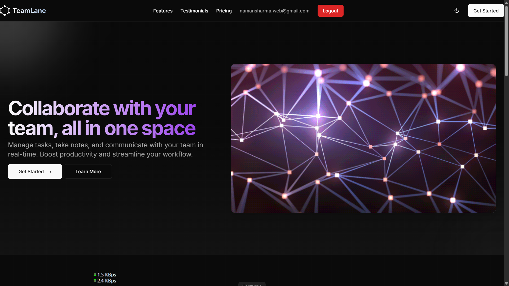

# 🚀 TeamLane

> A full-stack collaborative workspace platform for modern teams to manage projects, tasks, and communication — all in one place.
> visit at https://teamlane.vercel.app/



---

## 🧩 Features

- ✅ **Team Creation & Management**
  - Invite teammates using unique team codes
  - Role-based access: Admin / Member
  - Team-specific routing

- ✅ **Boards & Tasks**
  - Kanban-style boards with real-time updates
  - Categories: Development, Design, Planning, Marketing, Personal
  - Task statuses: Todo, In-Progress, Done
  - Assign tasks to members
  - Search, filter & favorite boards

- ✅ **Real-Time Collaboration**
  - WebSocket-powered task and board updates
  - Real-time UI feedback and sync

- ✅ **Authentication & Authorization**
  - Google OAuth via NextAuth.js
  - Middleware-protected routes
  - Session-based access control

- ✅ **Modern UI/UX**
  - Responsive design (desktop, tablet, mobile)
  - Dark/light theme support
  - Toasts, modals, keyboard shortcuts, breadcrumb nav

- ✅ **Progressive Web App (PWA)**
  - Installable on desktop and mobile
  - Manifest & icon setup for branding

---

## 🛠️ Tech Stack

| Layer       | Technology                     |
|------------|----------------------------------|
| Frontend   | Next.js (App Router), TypeScript |
| Styling    | TailwindCSS, Shadcn/UI           |
| Auth       | NextAuth.js + Google OAuth       |
| Backend    | Next.js API Routes               |
| Database   | MongoDB (Mongoose)               |
| Real-time  | Socket.IO (WebSockets)           |
| Hosting    | Vercel                           |

---

## ⚙️ Setup Instructions

1. **Clone the repo**:
   ```bash
   git clone https://github.com/namansharma28/teamlane.git
   cd teamlane
